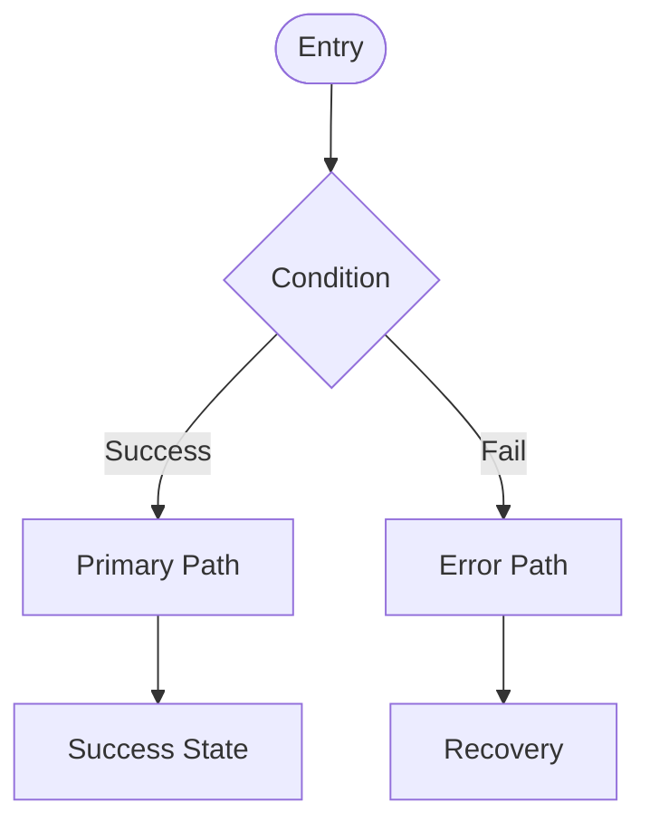

# Instructions

Generate platform-aware UX specifications focused on interactions and behavior patterns.
Output compact, structured documents that complement (not duplicate) feature specifications.

**Tools Usage:**
- `Read`: For loading PRD.md and spec.md files
- `Write`: For saving ux.md output
- `Bash`: For checking file existence
- `/mcp__sequential-thinking__sequentialthinking`: For complex analysis when needed
  - Uses Sequential Thinking methodology for structured reasoning

**Template:**
- UX: @.claude/templates/ux-template.md

**Project context:**
- PRD: @ai-docs/PRD.md

**File Structure:**
- Input: `./ai-docs/features/[feature]/` (expects spec.md)
- Output: `./ai-docs/features/[feature]/ux.md`

# Task

Transform feature specifications into compact UX documents.
Focus on user interactions, behavior patterns, and platform UX conventions.

# Core Principles

## Content Rules
- **Complement, don't duplicate** - Add UX insights, not repeat requirements
- **Structured data** - Use JSON for all component definitions, Mermaid for flows
- **Platform-aware** - Include only UX-relevant patterns for detected platform
- **Template compliance** - Exclude Review Checklist from final output

## Sequential Thinking Usage
Use `/mcp__sequential-thinking__sequentialthinking`:

For Platform Detection:
- When platform ambiguous: "Analyze keywords in spec → Check PRD context → Calculate platform confidence → Select best match"
- When multiple platforms possible: "Extract platform indicators → Weight by context → Compare scores → Determine primary platform"

For User Flow Generation:
- When mapping scenarios: "Extract acceptance scenarios → Identify decision points → Map error paths → Create complete flow"
- When validating flow completeness: "Check all paths → Verify error handling → Ensure recovery routes → Validate start/end points"

For Interaction Model:
- When selecting core actions: "List all user actions → Analyze frequency → Determine criticality → Select primary set"
- When defining states: "Map user journey → Identify state changes → Define transitions → Verify completeness"

For Error Presentation:
- When categorizing errors: "Analyze edge cases → Map to four types → Define UI responses → Ensure all scenarios covered"

# Execution Flow

## Phase 0: Context & Validation

### 0.1 Initialize UX Generation
```bash
# Validate required inputs exist
[ ! -f "./ai-docs/features/$FEATURE/spec.md" ] && echo "Error: spec.md not found" && exit 1
```

### 0.2 Load Sources
- Read `./ai-docs/features/[feature]/spec.md` → Extract requirements and functionality
- Read `./ai-docs/PRD.md` → Extract platform information and technical context

**Keep in context throughout execution**

## Phase 1: Platform Detection

### 1.1 Analyze Platform Indicators
```
PRD explicit platform → Use PRD platform
Else analyze keywords:
  - Mobile: iOS, Android, app, gesture, notification
  - Web: browser, responsive, URL, cookie, React
  - Desktop: Electron, Windows, macOS, system tray
  - Browser Extension: extension, popup, content script, chrome API, manifest
```

### 1.2 Confirm Platform
If platform unclear, apply `/mcp__sequential-thinking__sequentialthinking` for platform detection.

```
✅ Feature loaded: [feature-name]
🎯 Platform detected: [platform]
Generating [platform]-specific UX specification...
```

## Phase 2: Content Generation

### 2.1 Extract Core Functionality
From spec.md extract:
- Primary user story → Main flow
- Acceptance scenarios → Interaction points
- Requirements → UX patterns needed
- Edge cases → Critical scenarios

### 2.2 Generate User Flow
Apply `/mcp__sequential-thinking__sequentialthinking` for flow completeness analysis.

Create comprehensive Mermaid diagram showing complete user journey:


### 2.3 Build Interaction Model
Generate JSON for core user actions and system responses.

**Important:** Replace `[PRIMARY_ACTION_NAME]` and `[SECONDARY_ACTION_NAME]` with actual action names (e.g., "submit_form", "upload_file", "refresh_data")

```json
{
  "[actual_action_name]": {
    "trigger": "How user initiates",
    "feedback": "Immediate response",
    "success": "Success state",
    "error": "Error handling"
  }
}
```

For States & Transitions, define complete lifecycle states:
```json
{
  "initial": "User enters feature",
  "processing": "System handling request",
  "success": "Operation completed",
  "error": "Error state requiring user action"
}
```

### 2.4 Platform-Specific UX Patterns
**Include only non-N/A patterns for the detected platform. Remove entire platform section if all items are N/A.**

Key patterns by platform:
- **Mobile**: Gestures, Permissions, Offline behavior
- **Web**: Responsive breakpoints, Keyboard navigation, Browser handling
- **Desktop**: Window management, System integration, File operations
- **Browser Extension**: Permissions, Context injection, Storage strategy

### 2.5 Define Error Presentation
Apply `/mcp__sequential-thinking__sequentialthinking` for error categorization.

Define four error types (as required by template):
```json
{
  "network_failure": {
    "visual_indicator": "How error appears in UI",
    "message_template": "User-friendly message",
    "action_options": "What user can do",
    "auto_recovery": "Automatic UI behavior"
  },
  "validation_error": { ... },
  "timeout": { ... },
  "permission_denied": { ... }
}
```

### 2.6 Accessibility Standards
Define accessibility requirements:

- **Screen Readers**: ARIA requirements, label structure
- **Navigation**: Keyboard support, focus management
- **Visual**: Contrast requirements, color independence
- **Touch Targets**: Minimum sizes for mobile/desktop

## Phase 3: Assembly & Output

### 3.1 Structure Document
Follow template sections:
1. Header (platform)
2. User Flow (Mermaid)
3. Interaction Model (Core Actions, States & Transitions)
4. Platform-Specific Patterns (only non-N/A items)
5. Accessibility Standards (4 categories)
6. Error Presentation (4 error types)

**Note:** Do NOT include Review & Acceptance Checklist in final output

### 3.2 Optimize Content
- Keep descriptions concise but complete
- Remove any N/A sections entirely
- Priority: Flows > Interactions > Error Presentation > Accessibility

### 3.3 Write Document
Write to: `./ai-docs/features/[feature]/ux.md`

## Phase 4: Validate & Report

### 4.1 Content Validation
Verify:
- No duplication of spec.md content
- Focus on UX, not technical implementation
- Platform patterns are UX-relevant
- JSON structure valid
- All four error types defined

### 4.2 Report Success
```
✅ UX Specification Complete!

Feature: [feature-name]
Platform: [platform]
Location: ./ai-docs/features/[feature]/ux.md

Summary:
- User Flow: Generated
- Core Actions: Defined
- Platform Patterns: [platform]-specific
- Error Types: 4 scenarios covered
- Accessibility: Standards defined
```

# Error Handling

- **Missing files**: "Error: [file] not found. Run [command] first."
- **Platform unclear**: "Platform detection ambiguous. Using spec.md context for best match."
- **Template missing**: "Error: UX template not found at specified path"
- **Duplicate content**: "Warning: Content duplicates spec.md requirements. Regenerating..."
- **Invalid JSON**: "Error: Generated JSON structure invalid. Regenerating..."
- **Incomplete sections**: "Error: Missing required section: [section-name]"