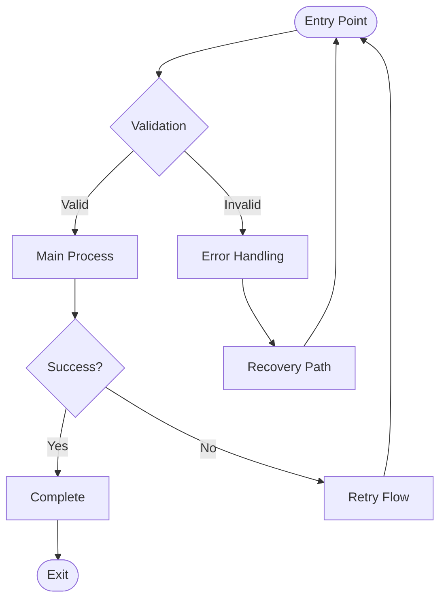

# UX Specification: [FEATURE_NAME]

**Platform**: [Web/Mobile/Desktop]  
**Dependencies**: [Related features]  
**Spec Reference**: [Link to spec.md]

## User Flow


*Note: Diagram can be expanded as needed for complex flows*

## Interaction Model

### Core Actions
```json
{
  "primary_action": {
    "trigger": "User tap/click on button",
    "feedback": "Loading spinner + message",
    "success": "Navigate to next screen",
    "error": "Modal with actionable message"
  },
  "cancel_action": {
    "trigger": "Back/Cancel button",
    "feedback": "Confirmation if data loss",
    "result": "Return to previous state"
  }
}
```

### States & Transitions
```json
{
  "idle": "Ready for input",
  "loading": "Processing request (spinner + message)",
  "success": "Action completed (auto-navigate)",
  "error": "Show error with recovery option"
}
```

## Platform-Specific Patterns

### Mobile (if applicable)
- **Gestures**: Swipe back, pull to refresh
- **Permissions**: Camera, storage, location
- **Offline**: Cache critical data, queue actions

### Web (if applicable)  
- **Responsive**: Mobile-first breakpoints (320px, 768px, 1024px)
- **Keyboard**: Tab navigation, Enter to submit, Esc to cancel
- **Browser**: Back button handling, form autosave

## UX Enhancements

### Performance
- Target load time: <3s
- Feedback within: 100ms
- Timeout handling: 10s with retry

### Accessibility
- Screen reader labels
- Keyboard navigation
- High contrast support
- Touch targets: 44pt (iOS) / 48dp (Android)

### Error Prevention
- Input validation on blur
- Confirmation for destructive actions
- Clear disabled states with tooltips

## Critical Scenarios

```json
{
  "network_failure": {
    "detection": "API call fails or timeout",
    "user_impact": "Cannot complete action",
    "solution": "Show offline message with retry button",
    "recovery": "Auto-retry when connection restored"
  },
  "invalid_input": {
    "detection": "Validation fails on blur/submit",
    "user_impact": "Cannot proceed",
    "solution": "Inline error with specific hints",
    "recovery": "Clear error on valid input"
  },
  "long_operation": {
    "detection": "Process takes >3 seconds",
    "user_impact": "Uncertainty about progress",
    "solution": "Progress bar with cancel option",
    "recovery": "Allow restart if cancelled"
  },
  "permission_denied": {
    "detection": "System returns permission error",
    "user_impact": "Feature unavailable",
    "solution": "Explain why needed + settings link",
    "recovery": "Re-check on app resume"
  }
}
```

## Success Metrics
- Task completion: >95%
- Time to complete: <30s
- Error rate: <5%
- Retry rate: <10%