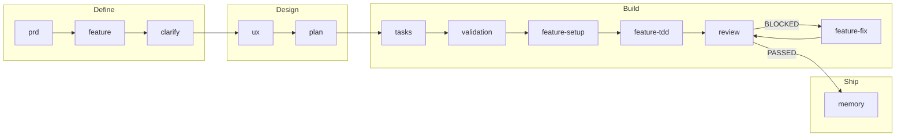

<p align="center">
  
</p>

<h1 align="center">MVP Builder</h1>

<p align="center">
  <strong>Build MVPs with AI agent that verifies its own work</strong><br>
  Claude Code instructions for Document-Driven Development
</p>

<p align="center">
  <a href="#the-approach">Approach</a> •
  <a href="#how-it-works">How It Works</a> •
  <a href="#installation">Installation</a>
</p>

---

## The Problem

AI coding agents are brilliant but unreliable:

- 🎭 **They hallucinate** — write code that "looks right" but doesn't work
- 🦥 **They cut corners** — stubs, mocks, "TODO: implement later"
- 🧠 **They forget** — lose context between sessions
- ✅ **They lie** — say "done" when work is half-finished

You end up debugging AI's mistakes instead of building your product.

---

## The Approach

If the agent performs poorly, the task description is lacking. AI models are strong reasoners but unreliable workers — they hallucinate, cut corners, and forget previous context. The fix is not just better prompts but structured specifications that require verifiable outputs.

### Core Principles

**Document-Driven Development**  
Specifications generate code, not vice versa. Every feature starts as structured documentation (PRD → spec → UX → plan) before any implementation begins.

**Verification Chain**  
Each requirement gets a test. Each test gets an implementation. Each implementation gets reviewed. Nothing ships without passing the chain.

```
FR-XXX → TEST-XXX → IMPL-XXX → CHK → REV
```

**Feedback Loop**  
Agents check their own work. Review finds issues → feedback.md captures them → fix agent resolves → review verifies. `AICODE-*` markers track what's resolved and what's still relevant. Context stays clean.

**Memory System**  
CLAUDE.md defines agent identity and rules. `/docs:memory` generates a code map of implemented features. Agent always knows who it is and where it stopped.

**Skills over Agents**  
The old approach: separate agent for each domain. The new approach: one general agent that loads skills for the task. Add expertise by adding folders, not rewriting agents.

---

## How It Works

### Pipeline



### Phase 1: Define

Transform product idea into structured specifications.

| Command | Output | Purpose |
|---------|--------|---------|
| `/docs:prd` | `PRD.md` | Product vision, audience, core problem |
| `/docs:feature` | `spec.md`, `FEATURES.md` | Feature specs with requirements (FR-XXX, UX-XXX) |
| `/docs:clarify` | Updated `spec.md` | Resolve ambiguities through targeted questions |

**After `/docs:feature`**: Add supplementary materials to `ai-docs/references/` — design systems, API schemas, content guidelines.

### Phase 2: Design

Convert specifications into technical architecture.

| Command | Output | Purpose |
|---------|--------|---------|
| `/docs:ux` | `ux.md` | User flows, states, error handling, accessibility |
| `/docs:plan` | `plan.md`, `data-model.md`, `contracts/`, `setup.md` | Architecture, entities, API specs, environment |

### Phase 3: Build

Execute implementation through TDD cycles with self-verification.

| Command / Agent | Output | Purpose |
|-----------------|--------|---------|
| `/docs:tasks` | `tasks.md` | INIT tasks + TDD cycles (TEST-XXX → IMPL-XXX) |
| `/docs:validation` | `validation/*.md` | Checklists with traceable checkpoints (CHK) |
| `feature-setup` | Infrastructure code | Execute INIT tasks, scaffold project |
| `feature-tdd` | Feature code + tests | RED-GREEN cycles, atomic commits |
| `/docs:review` | `feedback.md` | Verify implementation, generate findings (REV-XXX) |
| `feature-fix` | Fixed code | Apply fixes one error at a time |

**Review Loop**: If review status is BLOCKED → `feature-fix` → `/docs:review` → repeat until PASSED.

### Phase 4: Ship

Finalize and document completed implementation.

| Command | Output | Purpose |
|---------|--------|---------|
| `/docs:memory` | `README.md` | Code map with dependency graph for future sessions |

### Agents

Three specialized agents execute the Build phase:

| Agent | Role | When to use |
|-------|------|-------------|
| `feature-setup` | Scaffold infrastructure | After `/docs:validation`, executes INIT-XXX tasks |
| `feature-tdd` | TDD implementation | After setup, runs RED-GREEN cycles |
| `feature-fix` | Apply review fixes | When review status = BLOCKED, fixes one error at a time |

### Custom Agents

Need specialized behavior for your domain?

```
/generate:agent "your task description" [feature-path]
```

Analyzes codebase, matches relevant skills, generates `.claude/agents/your-agent.md`.

---

## Skills System

Skills are reusable capabilities that any agent can load on demand. Instead of hardcoding behavior into agents, MVP Builder matches tasks to skills automatically via `skills-rules.json`.

Each skill contains:
- Instructions for specific domain (analysis, documentation, git workflow)
- Decision rules with explicit conditions
- Tool permissions and constraints

Add new expertise by creating skill folders in `.claude/skills/`. The general agent loads what it needs, when it needs it.

---

## Document Structure

Generated by MVP Builder:

```
ai-docs/
├── PRD.md                      # Product vision
├── FEATURES.md                 # Feature index  
├── README.md                   # Code map (navigation for agents)
├── references/                 # Your supplementary materials
└── features/
    └── [feature-name]/
        ├── spec.md             # Requirements (FR-XXX, UX-XXX)
        ├── ux.md               # User flows and states
        ├── plan.md             # Architecture decisions
        ├── data-model.md       # Entities and validation
        ├── setup.md            # Environment config
        ├── contracts/          # API specifications
        ├── tasks.md            # TDD execution tasks
        ├── validation/         # Verification checklists
        └── feedback.md         # Review findings
```

---

## Installation

```bash
# Clone the repository
git clone https://github.com/[your-username]/mvp-builder.git

# Copy to your project
cp -r mvp-builder/.claude your-project/
cp -r mvp-builder/ai-docs your-project/
```

Start with `/docs:prd` to define your product.