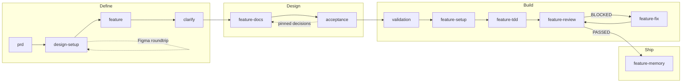

<p align="center">
  
</p>

<h1 align="center">MVP Builder</h1>

<p align="center">
  <strong>Build MVPs with AI — without the half-built mess.</strong><br>
  Document-Driven Development for Claude Code and Codex: specs before code, TDD enforced, self-review catches stubs.
</p>

<p align="center">
  <a href="#quickstart">Quickstart</a> •
  <a href="#what-sets-it-apart">What sets it apart</a> •
  <a href="#how-it-works">How it works</a>
</p>

---

## The Problem

AI coding agents are brilliant but unreliable:

- 🎭 **They hallucinate** — write code that "looks right" but doesn't work
- 🦥 **They cut corners** — stubs, mocks, "TODO: implement later"
- 🧠 **They forget** — lose context between sessions
- ✅ **They lie** — say "done" when work is half-finished

You end up debugging AI's mistakes instead of building your product.

---

## What sets it apart

> If the agent performs poorly, the task description is lacking.

The fix is not better prompts. It is **Document-Driven Development** — structured specifications that generate code, with verifiable outputs at every step.

**Specs that map to tests, not vibes.** Every feature is structured: `FR-XXX → TEST-XXX → IMPL-XXX → CHK → REV`. Skipping a step is detectable, not deniable.

**Orchestrated agent pipeline.** The main session dispatches specialized agents and validates every report between stages — it never implements inside the pipeline. Architectural decisions are pinned autonomously; only product questions — content, copy, domain semantics — reach you.

**Self-review with a fix loop.** `feature-review` produces `feedback.md` with concrete findings. `feature-fix` resolves them one at a time. `AICODE-*` markers track what is resolved across sessions — context resets do not erase progress.

**TDD enforced, not suggested.** Build phase runs RED-GREEN cycles. Tests come first, implementation follows, atomic commits keep the diff readable. The agent cannot ship a stub — the test would fail.

**Rules + Skills + Agents.** Extend by adding files, not rewriting agents. New language → drop a rule in `.claude/rules/`. New domain → drop a skill in `.claude/skills/`. Agents stay the same.

---

## Quickstart

**1. Install the plugin** — in Claude Code:

```
/plugin marketplace add app-builders-club/mvp-builder
/plugin install mvp-builder@mvp-builder
```

This ships the pipeline itself: agents, skills, and MCP server configuration.

**2. Initialize your project** — in your project directory:

```
/mvp-builder-init
```

This materializes the scaffold: `CLAUDE.md` (execution rules), path-scoped rules in `.claude/rules/`, and curated permissions in `.claude/settings.json`. Restart the session, then:

```
/prd
```

That is it. The PRD skill interviews you on product, audience, and core problem, then generates `PRD.md` and a `references/` folder you can populate with design systems, schemas, and screenshots. The pipeline takes you from there.

### Codex CLI

Same plugin, same flow:

```
codex plugin marketplace add app-builders-club/mvp-builder
codex plugin add mvp-builder@mvp-builder
```

Then in your project directory ask for the `mvp-builder-init` skill — it installs `AGENTS.md` (execution rules + a Platform Rules section), path-scoped rules in `.codex/rules/`, and subagent definitions in `.codex/agents/`. Enable subagents once: `multi_agent = true` under `[features]` in `~/.codex/config.toml`, then restart the session.

> Note: the `figma` MCP server is Claude-only for now (HTTP transport); `context7`, `sequential-thinking`, and `playwright` load on both platforms.

### Without the plugin

The standalone installer copies everything — agents, skills, scaffold, MCP configuration — into `.claude/` directly (Claude only):

**macOS, Linux, WSL:**

```bash
curl -fsSL https://raw.githubusercontent.com/app-builders-club/mvp-builder/main/scripts/install.sh | bash -s -- --standalone
```

**Windows PowerShell:**

```powershell
irm https://raw.githubusercontent.com/app-builders-club/mvp-builder/main/scripts/install.ps1 -OutFile install.ps1; .\install.ps1 -Standalone; rm install.ps1
```

### Upgrading and migrating

Run `/mvp-builder-init` (or the installer) again at any time:

- Files you have **not** modified are updated in place
- Files you **have** modified are kept — the new version lands alongside as `<file>.new` for manual merge
- A pre-plugin install (0.2.x and earlier) is detected automatically, backed up to `.mvp-builder-backup-<timestamp>/`, and replaced

---

## How it works

### Pipeline


```mermaid
flowchart LR
    subgraph DEFINE ["Define"]
        PRD["prd"] --> DSETUP["design-setup"]
        DSETUP --> FEATURE["feature"]
        FEATURE --> CLARIFY["clarify"]
        DSETUP -.->|"Figma roundtrip"| DSETUP
    end
    
    subgraph DESIGN ["Design"]
        CLARIFY --> DOCS["feature-docs"]
        DOCS --> ACCEPT["acceptance"]
        ACCEPT -.->|pinned decisions| DOCS
    end
    
    subgraph BUILD ["Build"]
        ACCEPT --> VAL["validation"]
        VAL --> SETUP["feature-setup"]
        SETUP --> TDD["feature-tdd"]
        TDD --> REVIEW["feature-review"]
        REVIEW -->|BLOCKED| FIX["feature-fix"]
        FIX --> REVIEW
    end
    
    subgraph SHIP ["Ship"]
        REVIEW -->|PASSED| MEMORY["feature-memory"]
    end
```

### Phase 1: Define

Transform product idea into structured specifications.

| Skill / Agent | Output | Purpose |
|---------|--------|---------|
| `/prd` | `PRD.md`, `references/` dir | Product vision, audience, core problem |
| `design-setup` | `references/design-system.md`, `tokens/`, `style-guide.md` | Normalize design references, extract from Figma |
| `/feature` | `spec.md`, `FEATURES.md` | Feature specs with requirements (FR-XXX, UX-XXX) |
| `/clarify` | Updated `spec.md` | Resolve ambiguities through targeted questions |

**After `/prd`**: Add supplementary materials to `ai-docs/references/` — design systems, tokens, schemas, API contracts, style guides, screenshots. Run `design-setup` agent to normalize raw generator output.

**Figma roundtrip** (optional): Run `design-setup [figma-url]` to extract tokens and screens from Figma. Refine in Figma, then re-run `design-setup [figma-url]` to pull changes back. Repeat until design is locked.

### Phase 2: Design

One agent generates the full derivative doc chain from the approved spec.

| Agent | Output | Purpose |
|-------|--------|---------|
| `feature-docs` | `ux.md`, `ui.md`, `plan.md`, `research.md`, `data-model.md`, `setup.md`, `contracts/`, `tasks.md` | Full doc chain in one pass on shared context; creates the `feature/[name]` branch |

`feature-docs` makes architectural decisions autonomously (recommended defaults) and flags uncertain ones for acceptance. The orchestrator reviews the report: architectural ⚠ items it resolves and pins itself; only intellectual items — content, copy, assets, domain semantics — go to you. Overrides re-dispatch the agent with pinned decisions.

### Phase 3: Build

Execute implementation through TDD cycles with self-verification.

| Skill / Agent | Output | Purpose |
|-----------------|--------|---------|
| `/validation` | `validation/*.md`, `resolutions.md` | Checklists with traceable checkpoints (CHK); architectural items resolved autonomously, intellectual ones through dialogue |
| `feature-setup` | Infrastructure code | Execute INIT tasks, scaffold project |
| `feature-tdd` | Feature code + tests | RED-GREEN cycles, atomic commits |
| `feature-review` | `feedback.md` | Verify implementation, generate findings (REV-XXX) |
| `feature-fix` | Fixed code | Apply fixes one error at a time |

**Review Loop**: If review status is BLOCKED → `feature-fix` → `feature-review` → repeat until PASSED. If the same finding survives 2 cycles, the orchestrator stops dispatching and finishes the fix directly.

### Phase 4: Ship

Finalize and document completed implementation.

| Agent | Output | Purpose |
|-------|--------|---------|
| `feature-memory [feature-path]` | `ai-docs/README.md` | Add feature to code map, rebuild dependency graph |
| `feature-memory` | `ai-docs/README.md` | Rescan entire project, capture all changes |

**Two modes**: with feature path — adds the feature entry and rebuilds the graph. Without arguments — full project rescan for changes made outside feature scope (refactoring, new shared modules, deleted files). Feature list is preserved, only the dependency graph is rebuilt from scratch. The code map is hard-capped at 1000 lines — every run ends with a size check and summarizes when needed.

### Agents

Specialized agents execute tasks across pipeline phases. The main session is the orchestrator: it dispatches agents, validates every report before the next stage, and owns the docs.

**Define phase:**

| Agent | Role | When to use |
|-------|------|-------------|
| `design-setup` | Normalize design references, extract Figma | When user adds design references to `ai-docs/references/` or provides a Figma URL |

**Design phase:**

| Agent | Role | When to use |
|-------|------|-------------|
| `feature-docs` | Generate doc chain ux → ui → plan → tasks | After `spec.md` is approved; creates the feature branch |

**Build phase:**

| Agent | Role | When to use |
|-------|------|-------------|
| `feature-setup` | Scaffold infrastructure | After `/validation`, executes INIT-XXX tasks |
| `feature-tdd` | TDD implementation | After setup, runs RED-GREEN cycles |
| `feature-review` | Quality gate | After TDD, verifies implementation and generates `feedback.md` |
| `feature-fix` | Apply review fixes | When review status = BLOCKED, fixes one error at a time |

**Ship phase:**

| Agent | Role | When to use |
|-------|------|-------------|
| `feature-memory` | Maintain the code map | After review PASSED, or for a full project rescan |

### Rules & Skills

**Rules** (`.claude/rules/`) are platform standards scoped by `paths` frontmatter — each loads only when working with matching files. Universal standards (git workflow, authentication, docker, design, code quality) live in `CLAUDE.md` and are always loaded.

| Rule | Scope | Paths |
|------|-------|-------|
| `frontend.md` | Next.js, Tailwind, testing, SSR | `**/*.tsx`, `**/*.jsx`, `**/*.css` |
| `backend.md` | ORM, validation, API design, logging | `**/prisma/**`, `**/api/**`, `**/*.py` |
| `mobile.md` | Cross-platform native mobile | `**/*.swift`, `**/*.kt`, `**/*.dart` |
| `ios.md` | Swift style, concurrency, SwiftUI, SwiftData | `**/*.swift`, `**/*.xcodeproj/**` |

**Skills** (shipped with the plugin) come in two kinds: pipeline skills invoked directly in chat (`/prd`, `/feature`, `/clarify`, `/validation`) that drive the dialogue stages, and domain skills loaded on demand by agents when the task requires specific expertise.

Each skill contains:
- Instructions for a specific domain (analysis, documentation, pipeline stage)
- Decision rules with explicit conditions

Add new standards: create a rule file in `.claude/rules/`.  
Add new expertise: create a skill folder in `.claude/skills/`.

---

## Document structure

Generated by MVP Builder:

```
ai-docs/
├── PRD.md                      # Product vision
├── FEATURES.md                 # Feature index  
├── README.md                   # Code map (navigation for agents)
├── references/                 # Design systems, tokens, schemas, style guides, screens, API contracts
└── features/
    └── [feature-name]/
        ├── spec.md             # Requirements (FR-XXX, UX-XXX)
        ├── ux.md               # User flows and states
        ├── ui.md               # Component trees, DS mapping, layout
        ├── plan.md             # Architecture decisions
        ├── research.md         # Technical research and rationale
        ├── data-model.md       # Entities and validation
        ├── setup.md            # Environment config
        ├── contracts/          # API specifications
        ├── tasks.md            # TDD execution tasks
        ├── validation/         # Verification checklists
        └── feedback.md         # Review findings
```

---

## Part of App Builders Club

`mvp-builder` is one of three open-source tools we ship for builders who code with AI:

- **mvp-builder** — this repo. Document-Driven Development for Claude Code. Specs before code, TDD enforced, self-review catches stubs.
- **[design-builder](https://github.com/app-builders-club/design-builder)** — production-grade UIs from Claude Code without the AI-slop look.
- **[designlib-mcp](https://github.com/app-builders-club/designLib-mcp)** — the design-knowledge MCP that powers design-builder. Works standalone in any MCP client.

Methodology and build films at [app-builders.club](https://app-builders.club) · YouTube [@appbuildersclub](https://youtube.com/@appbuildersclub)

---

## License

MIT. See [LICENSE](LICENSE).