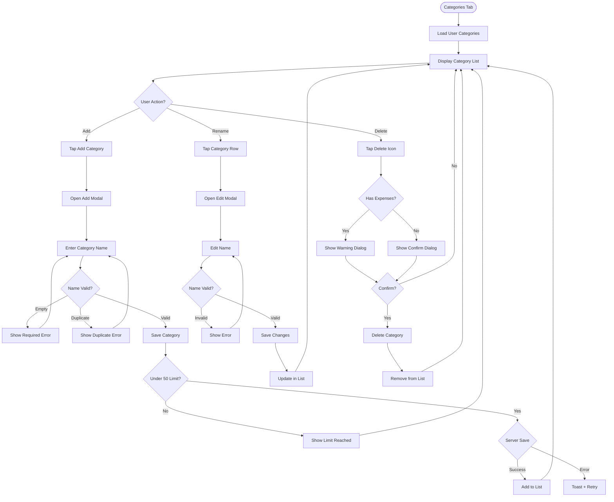

# UX Specification: Category Management

**Platform**: Web (Mobile-first Responsive)

## User Flow



**Exit Path Behaviors:**
- **Cancel (in modal)**: Modal closes, no changes saved
- **Back Button (in modal)**: Same as Cancel
- **Navigate Away**: Any pending saves complete in background

## Interaction Model

### Core Actions
- **add_category**
  ```json
  {
    "trigger": "Tap Add button",
    "feedback": "Modal opens with empty name field focused",
    "success": "Modal closes, new category appears in list",
    "error": "Inline error for validation, toast for server errors"
  }
  ```

- **rename_category**
  ```json
  {
    "trigger": "Tap category row",
    "feedback": "Modal opens with current name pre-filled",
    "success": "Modal closes, list shows updated name",
    "error": "Inline error for validation, toast for server errors"
  }
  ```

- **delete_category**
  ```json
  {
    "trigger": "Tap delete icon on row",
    "feedback": "Confirmation dialog appears (with warning if has expenses)",
    "success": "Category removed from list",
    "error": "Toast with retry option"
  }
  ```

### States & Transitions
```json
{
  "viewing": "Category list displayed",
  "adding": "Add modal open",
  "editing": "Edit modal open with category data",
  "confirming_delete": "Delete confirmation dialog visible",
  "limit_reached": "At 50 categories, add disabled"
}
```

## Quantified UX Elements

| Element | Formula / Source Reference |
|---------|----------------------------|
| Max categories per user | 50 (constant) |
| Default categories count | 6 (Food, Transport, Entertainment, Shopping, Bills, Other) |
| Category name max length | 50 characters (constant) |

## Platform-Specific Patterns

### Web
- **Responsive**: List is full-width on mobile, card-based on desktop
- **Keyboard**: Tab through list items, Enter opens edit, Delete key triggers delete confirmation
- **Browser**: Standard form validation for name field

## Accessibility Standards

- **Screen Readers**: ARIA `role="list"` for category list, `aria-label` describing each item's actions, `role="alertdialog"` for confirmations
- **Navigation**: Tab cycles through Add → List items → each item's Edit/Delete, Escape closes modals
- **Visual**: Contrast ratio 4.5:1, delete action uses red + trash icon
- **Touch Targets**: 44px minimum for all interactive elements

## Error Presentation

```json
{
  "network_failure": {
    "visual_indicator": "Toast notification",
    "message_template": "Couldn't save category. Check your connection.",
    "action_options": "Retry button in toast",
    "auto_recovery": "Modal stays open, data preserved"
  },
  "validation_error": {
    "visual_indicator": "Red border on name field, inline message",
    "message_template": "Category name is required / This category already exists",
    "action_options": "User corrects input",
    "auto_recovery": "Error clears when input becomes valid"
  },
  "timeout": {
    "visual_indicator": "Toast notification",
    "message_template": "Request timed out. Please try again.",
    "action_options": "Retry button",
    "auto_recovery": "Modal stays open, data preserved"
  },
  "permission_denied": {
    "visual_indicator": "Inline message in Add modal",
    "message_template": "You've reached the maximum of 50 categories.",
    "action_options": "Delete unused categories first",
    "auto_recovery": "None until categories deleted"
  }
}
```
