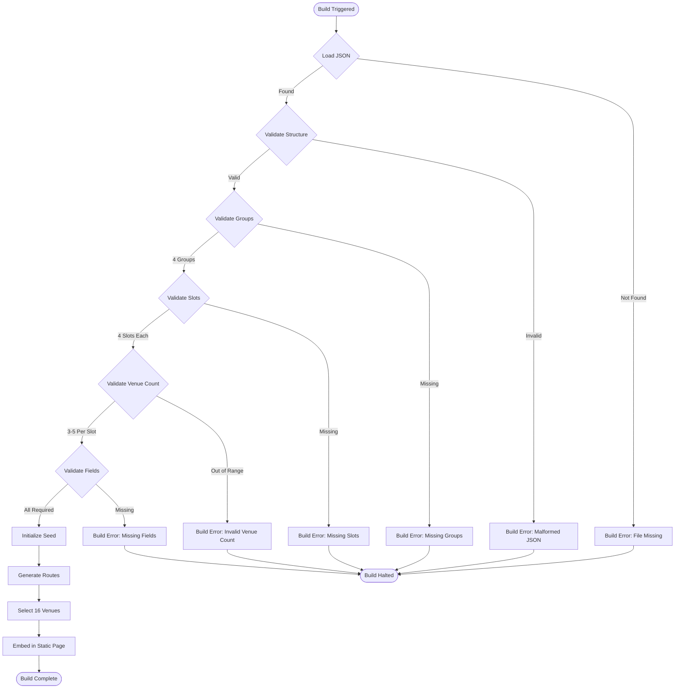

# UX Specification: Daily Route Generator

**Platform**: Build-time Module (Node.js)

## User Flow



**Exit Path Behaviors:**
- **Build Error**: Immediate halt, no partial output, descriptive error message to console
- **Validation Failure**: Halt before route generation, list all validation errors
- **Success**: Routes embedded in static bundle, no runtime state to manage

## Interaction Model

### Core Actions

- **load_source_data**
  ```json
  {
    "trigger": "Build process starts",
    "feedback": "Console log: Loading bantadthong_places.json",
    "success": "JSON parsed into SourceData object",
    "error": "Build halts with file path and parse error details"
  }
  ```

- **validate_source_data**
  ```json
  {
    "trigger": "Source data loaded successfully",
    "feedback": "Console log: Validating venue data...",
    "success": "All 4 groups, 4 slots each, 3-5 venues per slot validated",
    "error": "Build halts with specific validation failures listed"
  }
  ```

- **generate_daily_routes**
  ```json
  {
    "trigger": "Validation passes",
    "feedback": "Console log: Generating routes for [YYYY-MM-DD]...",
    "success": "DailyRoutes object with 16 venues created",
    "error": "N/A - deterministic selection cannot fail after validation"
  }
  ```

- **embed_routes**
  ```json
  {
    "trigger": "Routes generated",
    "feedback": "Console log: Embedding routes in static bundle...",
    "success": "Routes available as static import for UI features",
    "error": "N/A - static embedding is framework-handled"
  }
  ```

### States & Transitions
```json
{
  "idle": "Build not started, module not invoked",
  "loading": "Reading bantadthong_places.json from disk",
  "validating": "Checking structure, groups, slots, venues, fields",
  "generating": "Using seedrandom to select 16 venues deterministically",
  "embedding": "Writing routes to static bundle output",
  "complete": "Routes embedded, build continues to next step",
  "failed": "Validation or load error, build halted with error output"
}
```

## Quantified UX Elements

| Element | Formula / Source Reference |
|---------|----------------------------|
| Total groups | Fixed: 4 (GROUP_NAMES.length) |
| Slots per group | Fixed: 4 (SLOTS.length) |
| Venues per slot | Range: MIN_VENUES_PER_SLOT (3) to MAX_VENUES_PER_SLOT (5) |
| Total source venues | 72 (4 groups × 4 slots × avg 4.5 venues) |
| Total daily venues | TOTAL_DAILY_VENUES = 16 (4 groups × 4 slots × 1 selected) |
| Date seed format | DATE_SEED_FORMAT = 'YYYY-MM-DD' |
| Route combinations per group | min 81 (3^4) to max 625 (5^4) |
| Daily repeat probability | < 0.1% (1 in 1000+ combinations) |

## Platform-Specific Patterns

### Build Environment
- **Determinism**: seedrandom library ensures identical output for same date across all platforms
- **Static Import**: Routes exported as ES module for tree-shaking optimization
- **Type Safety**: TypeScript interfaces validate structure at compile time

## Accessibility Standards

- **Screen Readers**: N/A - build-time module with no UI
- **Navigation**: N/A - no interactive elements
- **Visual**: N/A - console output only
- **Touch Targets**: N/A - no touch interface

## Error Presentation

```json
{
  "network_failure": {
    "visual_indicator": "N/A - local file read, no network",
    "message_template": "N/A",
    "action_options": "N/A",
    "auto_recovery": "N/A"
  },
  "validation_error": {
    "visual_indicator": "Console error with red text (build tool styling)",
    "message_template": "Error: [GroupName].[Slot] has [X] venues, requires 3-5",
    "action_options": "Fix bantadthong_places.json and rebuild",
    "auto_recovery": "None - build halts immediately"
  },
  "timeout": {
    "visual_indicator": "N/A - synchronous file read, no timeout",
    "message_template": "N/A",
    "action_options": "N/A",
    "auto_recovery": "N/A"
  },
  "permission_denied": {
    "visual_indicator": "Console error with file path",
    "message_template": "Error: bantadthong_places.json not found at [path]",
    "action_options": "Verify file exists in src/data/ directory",
    "auto_recovery": "None - build halts immediately"
  }
}
```

## Consumer Integration

### Data Flow to UI Features
```json
{
  "group-selector": {
    "consumes": "GROUP_NAMES constant",
    "usage": "Display 4 group pills in fixed order"
  },
  "route-summary": {
    "consumes": "DailyRoutes[selectedGroup], SLOT_LABELS",
    "usage": "Display 4 venue names with slot emojis"
  },
  "venue-cards": {
    "consumes": "DailyRoutes[selectedGroup][slot]",
    "usage": "Display venue details (name, type, rating, story, Maps URI)"
  }
}
```

### Import Pattern
```typescript
// UI features import from route-generator module
import { dailyRoutes, GROUP_NAMES, SLOT_LABELS } from '@/lib/route-generator';

// Routes are pre-generated at build time
// No loading state needed - data always available
```
