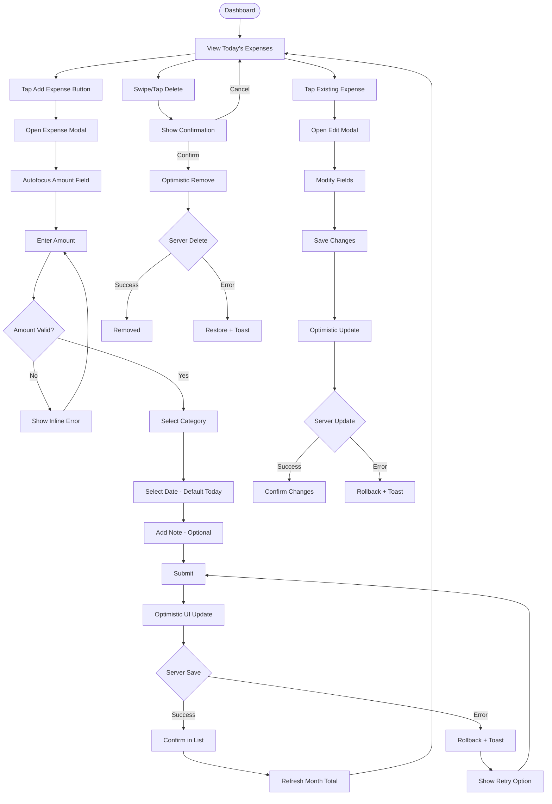

# UX Specification: Expense CRUD

**Platform**: Web (Mobile-first Responsive)

## User Flow



**Exit Path Behaviors:**
- **Cancel (in modal)**: Modal closes, no data saved, form state cleared
- **Back Button (in modal)**: Same as Cancel, modal closes
- **Close Modal (X button)**: Same as Cancel, unsaved data discarded
- **Navigate Away**: Pending optimistic updates continue in background

## Interaction Model

### Core Actions
- **create_expense**
  ```json
  {
    "trigger": "Tap sticky Add button or FAB",
    "feedback": "Modal slides up, amount field focused",
    "success": "Modal closes, expense appears in list instantly (optimistic)",
    "error": "Toast with retry, form data preserved"
  }
  ```

- **edit_expense**
  ```json
  {
    "trigger": "Tap expense row in list",
    "feedback": "Modal opens with pre-filled data",
    "success": "Modal closes, list reflects changes instantly",
    "error": "Toast with retry, changes rolled back visually"
  }
  ```

- **delete_expense**
  ```json
  {
    "trigger": "Swipe left on mobile or tap delete icon",
    "feedback": "Confirmation dialog appears",
    "success": "Item removed from list, totals update",
    "error": "Item restored, toast with error message"
  }
  ```

- **validate_amount**
  ```json
  {
    "trigger": "Blur from amount field or form submit",
    "feedback": "Instant inline validation",
    "success": "No message, proceed to next field",
    "error": "Red border + message: 'Enter amount greater than 0'"
  }
  ```

### States & Transitions
```json
{
  "viewing": "Expense list displayed, ready for interaction",
  "creating": "Add modal open, entering new expense",
  "editing": "Edit modal open, modifying existing expense",
  "saving": "Optimistic update applied, awaiting server confirmation",
  "confirming_delete": "Delete confirmation dialog visible",
  "error": "Operation failed, retry available"
}
```

## Quantified UX Elements

| Element | Formula / Source Reference |
|---------|----------------------------|
| Optimistic UI timeout | 200ms perceived response (API p95 target) |
| Amount decimal places | 2 maximum (constant) |
| Expense limit per user | 100,000 (constant) |
| Target logging time | < 10 seconds from tap to saved |

## Platform-Specific Patterns

### Web
- **Responsive**: Sticky bottom button on mobile, inline button on desktop; modal is full-screen on mobile, centered overlay on desktop
- **Keyboard**: Tab through Amount → Category → Date → Note → Submit, Enter submits, Escape closes modal
- **Browser**: Form autofill disabled for amount field

### Mobile
- **Gestures**: Swipe left to reveal delete action on expense rows
- **Offline**: N/A (requires connectivity for MVP)

## Accessibility Standards

- **Screen Readers**: ARIA `role="dialog"` for modal, `aria-label` on form, `aria-live="assertive"` for optimistic confirmation
- **Navigation**: Focus trapped in modal, Tab cycles through fields, Escape closes modal, Enter submits
- **Visual**: Contrast ratio 4.5:1, success/error states use icon + color
- **Touch Targets**: 44px minimum for all buttons, 48px for primary Add button

## Error Presentation

```json
{
  "network_failure": {
    "visual_indicator": "Toast notification, optimistic UI rolled back",
    "message_template": "Couldn't save expense. Check your connection.",
    "action_options": "Retry button in toast, form data preserved",
    "auto_recovery": "Toast dismisses after 5s, modal stays open"
  },
  "validation_error": {
    "visual_indicator": "Red border on field, inline message below",
    "message_template": "Amount must be greater than 0 / Please select a category",
    "action_options": "User corrects input",
    "auto_recovery": "Error clears when field becomes valid"
  },
  "timeout": {
    "visual_indicator": "Toast notification, optimistic UI rolled back",
    "message_template": "Request timed out. Please try again.",
    "action_options": "Retry button preserves form data",
    "auto_recovery": "Modal stays open, form enabled"
  },
  "permission_denied": {
    "visual_indicator": "Toast notification",
    "message_template": "Session expired. Please log in again.",
    "action_options": "Redirect to login",
    "auto_recovery": "None, requires re-authentication"
  }
}
```
