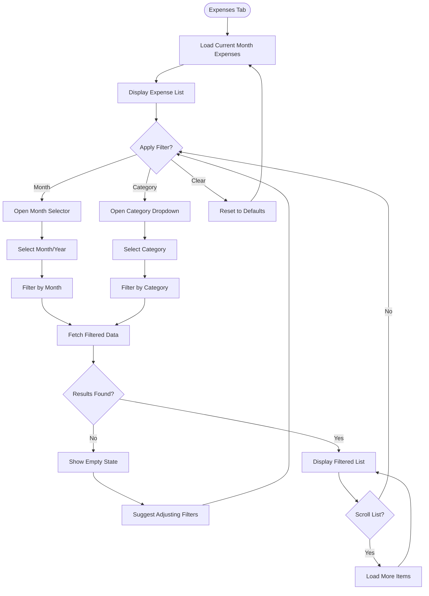

# UX Specification: Expense Filtering

**Platform**: Web (Mobile-first Responsive)

## User Flow



**Exit Path Behaviors:**
- **Navigate to other tab**: Filter state preserved in session
- **Back Button**: Return to previous tab, filters cleared
- **Close Browser**: Filter state lost, returns to defaults on next visit

## Interaction Model

### Core Actions
- **filter_by_month**
  ```json
  {
    "trigger": "Tap month selector, choose month/year",
    "feedback": "Selector closes, list shows loading shimmer briefly",
    "success": "List updates with filtered expenses",
    "error": "Toast if fetch fails, previous results retained"
  }
  ```

- **filter_by_category**
  ```json
  {
    "trigger": "Tap category dropdown, select option",
    "feedback": "Dropdown closes, list updates immediately",
    "success": "Only matching expenses shown",
    "error": "Toast if fetch fails, previous results retained"
  }
  ```

- **clear_filters**
  ```json
  {
    "trigger": "Tap 'Clear' or 'All' option",
    "feedback": "Filters reset to defaults visually",
    "success": "Full expense list for current month displayed",
    "error": "N/A - local operation"
  }
  ```

- **scroll_load_more**
  ```json
  {
    "trigger": "Scroll near bottom of list",
    "feedback": "Loading spinner at list bottom",
    "success": "More items appended to list",
    "error": "Toast with retry, existing items preserved"
  }
  ```

### States & Transitions
```json
{
  "default": "Current month, all categories, list loaded",
  "filtering": "Filter change in progress, loading indicator",
  "filtered": "Subset of expenses displayed based on criteria",
  "empty": "No expenses match current filters",
  "loading_more": "Fetching additional items for infinite scroll"
}
```

## Quantified UX Elements

| Element | Formula / Source Reference |
|---------|----------------------------|
| Initial page size | 50 items (constant for virtualization) |
| Load more threshold | 10 items from bottom (constant) |
| Max expenses per user | 100,000 (constant) |
| Filter debounce delay | 300ms (constant for rapid switching) |

## Platform-Specific Patterns

### Web
- **Responsive**: Filters inline on mobile (full-width), side-by-side on desktop
- **Keyboard**: Tab to month → Tab to category, Enter/Space opens selectors
- **Browser**: Filter state stored in URL params for shareability (optional enhancement)

## Accessibility Standards

- **Screen Readers**: ARIA `role="listbox"` for dropdowns, `aria-selected` for current filter, `aria-live="polite"` for result count updates
- **Navigation**: Tab cycles through Month → Category → Clear → List items, Arrow keys navigate within dropdowns
- **Visual**: Contrast ratio 4.5:1, selected state indicated by icon + background color
- **Touch Targets**: 44px minimum for filter controls

## Error Presentation

```json
{
  "network_failure": {
    "visual_indicator": "Toast notification",
    "message_template": "Couldn't load expenses. Check your connection.",
    "action_options": "Retry button in toast",
    "auto_recovery": "Previous results remain visible"
  },
  "validation_error": {
    "visual_indicator": "N/A - filters are constrained selections",
    "message_template": "N/A",
    "action_options": "N/A",
    "auto_recovery": "N/A"
  },
  "timeout": {
    "visual_indicator": "Toast notification",
    "message_template": "Request timed out. Please try again.",
    "action_options": "Retry button",
    "auto_recovery": "Previous results remain visible"
  },
  "permission_denied": {
    "visual_indicator": "Toast notification",
    "message_template": "Session expired. Please log in again.",
    "action_options": "Redirect to login",
    "auto_recovery": "None, requires re-authentication"
  }
}
```
