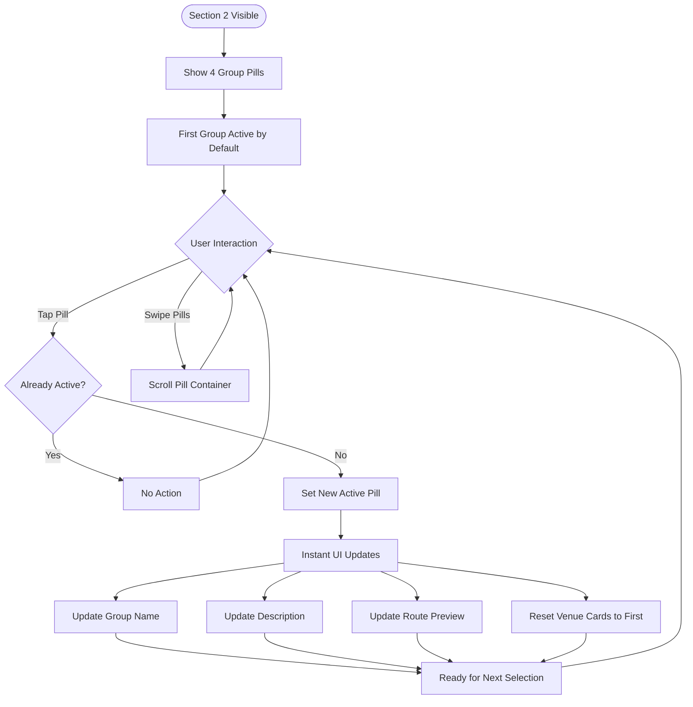

# UX Specification: Group Selector

**Platform**: Web (Mobile-first)

## User Flow



**Exit Path Behaviors:**
- **Scroll Away**: Current selection persists, no cleanup needed
- **Group Switch**: Previous selection state discarded, new group state applied instantly

## Interaction Model

### Core Actions

- **tap_pill**
  ```json
  {
    "trigger": "Tap on inactive group pill",
    "feedback": "Pill immediately shows active styling (accent bg, border, text)",
    "success": "All dependent UI updates instantly: group name, description, route preview, venue cards reset",
    "error": "N/A - all pills are valid selections"
  }
  ```

- **scroll_pills**
  ```json
  {
    "trigger": "Horizontal swipe on pill container",
    "feedback": "Pills scroll horizontally with momentum",
    "success": "Hidden pills become visible",
    "error": "At scroll boundary, elastic bounce effect"
  }
  ```

### States & Transitions
```json
{
  "pan_asian_active": "Pan-Asian Flavors selected, showing its route data",
  "urban_hideaways_active": "Urban Hideaways selected, showing its route data",
  "sweet_bangkok_active": "Sweet Bangkok selected, showing its route data",
  "local_thai_active": "Local Thai Experience selected, showing its route data"
}
```

## Quantified UX Elements

| Element | Formula / Source Reference |
|---------|----------------------------|
| Pill count | Fixed: 4 (from PRD.Technical Constraints) |
| Active background opacity | 15% of accent color #ff9500 |
| Touch target size | Minimum 44px height (WCAG 2.1 AAA) |
| Update latency | 0ms (instant, no animations per PRD) |

## Platform-Specific Patterns

### Web
- **Responsive**: Pills overflow horizontally on narrow viewports; scroll-snap for aligned stopping
- **Keyboard**: Tab focuses pill container; Arrow Left/Right moves between pills; Enter/Space selects
- **Browser**: overflow-x: auto with -webkit-overflow-scrolling: touch for iOS momentum

### Mobile
- **Gestures**: Tap to select; horizontal swipe to scroll pills; no long-press actions
- **Offline**: Static content, fully functional offline

## Accessibility Standards

- **Screen Readers**: role="tablist" on container; role="tab" on each pill; aria-selected="true" on active; aria-controls links to content panels
- **Navigation**: Tab to container; Arrow keys between pills; Enter/Space to select
- **Visual**: Active state uses color (#ff9500) + border + text change; not color alone
- **Touch Targets**: Pills minimum 44x44px touch area with adequate spacing

## Error Presentation

```json
{
  "network_failure": {
    "visual_indicator": "N/A - static content, no network required",
    "message_template": "N/A",
    "action_options": "N/A",
    "auto_recovery": "N/A"
  },
  "validation_error": {
    "visual_indicator": "N/A - all selections valid",
    "message_template": "N/A",
    "action_options": "N/A",
    "auto_recovery": "N/A"
  },
  "timeout": {
    "visual_indicator": "N/A - instant state updates",
    "message_template": "N/A",
    "action_options": "N/A",
    "auto_recovery": "N/A"
  },
  "permission_denied": {
    "visual_indicator": "N/A - no permissions required",
    "message_template": "N/A",
    "action_options": "N/A",
    "auto_recovery": "N/A"
  }
}
```
