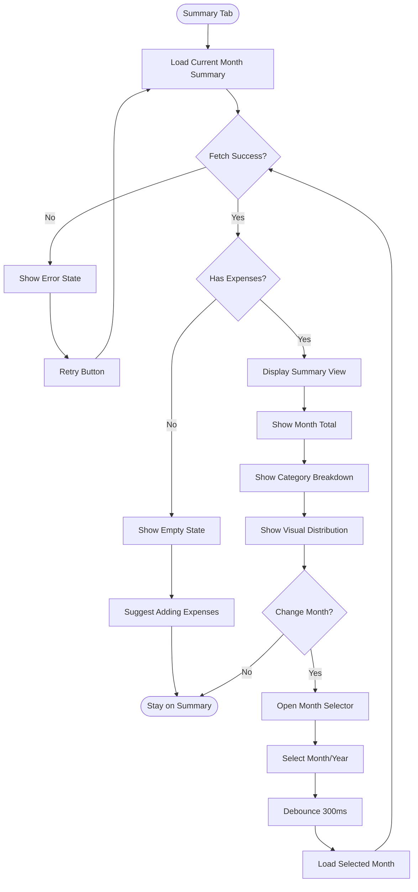

# UX Specification: Monthly Summary

**Platform**: Web (Mobile-first Responsive)

## User Flow



**Exit Path Behaviors:**
- **Navigate to other tab**: No cleanup needed
- **Back Button**: Return to previous tab
- **Close Browser**: No state persisted, reloads current month on return

## Interaction Model

### Core Actions
- **load_summary**
  ```json
  {
    "trigger": "Navigate to Summary tab or select different month",
    "feedback": "Loading skeleton for total and breakdown",
    "success": "Summary data displayed with visual chart",
    "error": "Error state with retry option"
  }
  ```

- **change_month**
  ```json
  {
    "trigger": "Tap month selector, choose month/year",
    "feedback": "Selector closes, content shows loading state",
    "success": "Summary updates for selected month",
    "error": "Toast with retry, previous data retained"
  }
  ```

- **view_category_detail**
  ```json
  {
    "trigger": "Tap category row in breakdown",
    "feedback": "Visual highlight on selected category",
    "success": "Category emphasized in chart (optional enhancement)",
    "error": "N/A - local interaction"
  }
  ```

### States & Transitions
```json
{
  "loading": "Fetching summary data, skeleton visible",
  "displaying": "Summary data shown with total, breakdown, chart",
  "empty": "No expenses for selected month",
  "error": "Failed to load, retry available",
  "switching_month": "Month change in progress, debouncing"
}
```

## Quantified UX Elements

| Element | Formula / Source Reference |
|---------|----------------------------|
| Month total | SUM(expenses.amount) WHERE month = selected_month |
| Category amount | SUM(expenses.amount) WHERE category = X AND month = selected_month |
| Category percentage | (category_amount / month_total) * 100, rounded to 1 decimal |
| Debounce delay | 300ms (constant for rapid month switching) |
| Load time target | < 1s on decent connection |

## Platform-Specific Patterns

### Web
- **Responsive**: Stacked layout on mobile (total → chart → breakdown), side-by-side on desktop (chart left, breakdown right)
- **Keyboard**: Tab to month selector, Arrow keys navigate months, Enter confirms selection
- **Browser**: No special browser features required

## Accessibility Standards

- **Screen Readers**: ARIA `role="region"` for summary, `aria-label` on total amount, `aria-describedby` for chart description, live region announces updates
- **Navigation**: Tab cycles through Month selector → Chart → Category list items
- **Visual**: Contrast ratio 4.5:1, chart uses distinct colors + patterns for colorblind accessibility
- **Touch Targets**: 44px minimum for month selector and category rows

## Error Presentation

```json
{
  "network_failure": {
    "visual_indicator": "Full-area error state with icon",
    "message_template": "Couldn't load summary. Check your connection.",
    "action_options": "Retry button centered in view",
    "auto_recovery": "None, requires manual retry"
  },
  "validation_error": {
    "visual_indicator": "N/A - no user input validation",
    "message_template": "N/A",
    "action_options": "N/A",
    "auto_recovery": "N/A"
  },
  "timeout": {
    "visual_indicator": "Toast notification",
    "message_template": "Request timed out. Please try again.",
    "action_options": "Retry button",
    "auto_recovery": "Previous data retained if available"
  },
  "permission_denied": {
    "visual_indicator": "Full-area message",
    "message_template": "Session expired. Please log in again.",
    "action_options": "Login button",
    "auto_recovery": "Redirect to login on button click"
  }
}
```
