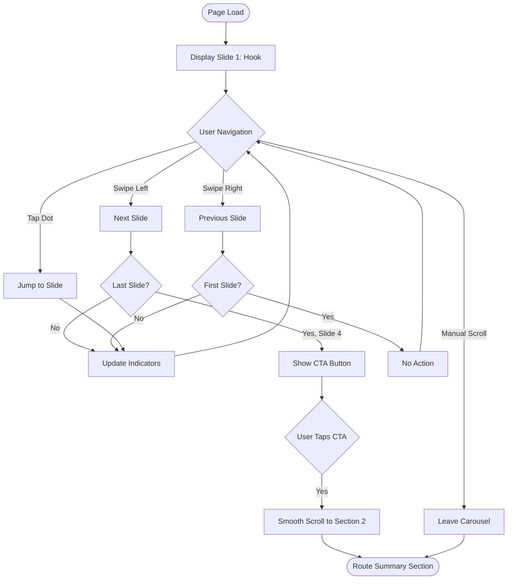

# UX Specification: Onboarding Carousel

**Platform**: Web (Mobile-first)

## User Flow



**Exit Path Behaviors:**
- **Manual Scroll Down**: No cleanup needed, user continues to next section naturally
- **CTA Tap**: Triggers 500ms smooth scroll, no state to preserve

## Interaction Model

### Core Actions

- **swipe_slide**
  ```json
  {
    "trigger": "Horizontal swipe gesture on carousel",
    "feedback": "Slide animates in swipe direction, dot indicator updates",
    "success": "Adjacent slide becomes visible, dots reflect new position",
    "error": "At boundary (slide 1 or 4), swipe bounces back with no navigation"
  }
  ```

- **tap_dot**
  ```json
  {
    "trigger": "Tap on dot indicator",
    "feedback": "Tapped dot highlights, carousel animates to target slide",
    "success": "Target slide visible, all dots update to reflect position",
    "error": "N/A - all dots are valid targets"
  }
  ```

- **tap_cta**
  ```json
  {
    "trigger": "Tap 'Taste Today's Story' button on slide 4",
    "feedback": "Button shows pressed state, page begins scrolling",
    "success": "Page smoothly scrolls to Route Summary section over 500ms",
    "error": "N/A - scroll target always exists"
  }
  ```

### States & Transitions
```json
{
  "slide_1_active": "Hook content visible, prev-swipe blocked, CTA hidden",
  "slide_2_active": "Problem content visible, both swipe directions enabled",
  "slide_3_active": "Solution content visible, both swipe directions enabled",
  "slide_4_active": "CTA content visible, next-swipe blocked, CTA button visible"
}
```

## Quantified UX Elements

| Element | Formula / Source Reference |
|---------|----------------------------|
| Slide count | Fixed: 4 (from PRD.Technical Constraints) |
| Carousel height | 100vh (full viewport) |
| Auto-scroll duration | 500ms (from PRD.Navigation) |
| Dot indicator count | slide_count = 4 |

## Platform-Specific Patterns

### Web
- **Responsive**: Carousel maintains 100vh across all viewport sizes; content scales proportionally
- **Keyboard**: Arrow keys navigate slides when carousel focused; Tab moves to dot indicators
- **Browser**: Smooth scroll uses CSS scroll-behavior or requestAnimationFrame fallback

### Mobile
- **Gestures**: Horizontal swipe with 50px threshold for slide change; velocity-based snap
- **Offline**: Static content, fully functional offline after initial load

## Accessibility Standards

- **Screen Readers**: role="region" with aria-label="Onboarding"; aria-live="polite" on slide content; dots use role="tablist" with role="tab" children
- **Navigation**: Tab cycles through dots; Enter/Space activates dot; Arrow Left/Right on dots navigates
- **Visual**: Text contrast minimum 4.5:1 against #0a0a0a background; active dot uses color + size difference
- **Touch Targets**: Dot indicators minimum 44x44px; CTA button minimum 48px height

## Error Presentation

```json
{
  "network_failure": {
    "visual_indicator": "N/A - static content, no network required at runtime",
    "message_template": "N/A",
    "action_options": "N/A",
    "auto_recovery": "N/A"
  },
  "validation_error": {
    "visual_indicator": "N/A - no user input",
    "message_template": "N/A",
    "action_options": "N/A",
    "auto_recovery": "N/A"
  },
  "timeout": {
    "visual_indicator": "N/A - no async operations",
    "message_template": "N/A",
    "action_options": "N/A",
    "auto_recovery": "N/A"
  },
  "permission_denied": {
    "visual_indicator": "N/A - no permissions required",
    "message_template": "N/A",
    "action_options": "N/A",
    "auto_recovery": "N/A"
  }
}
```
