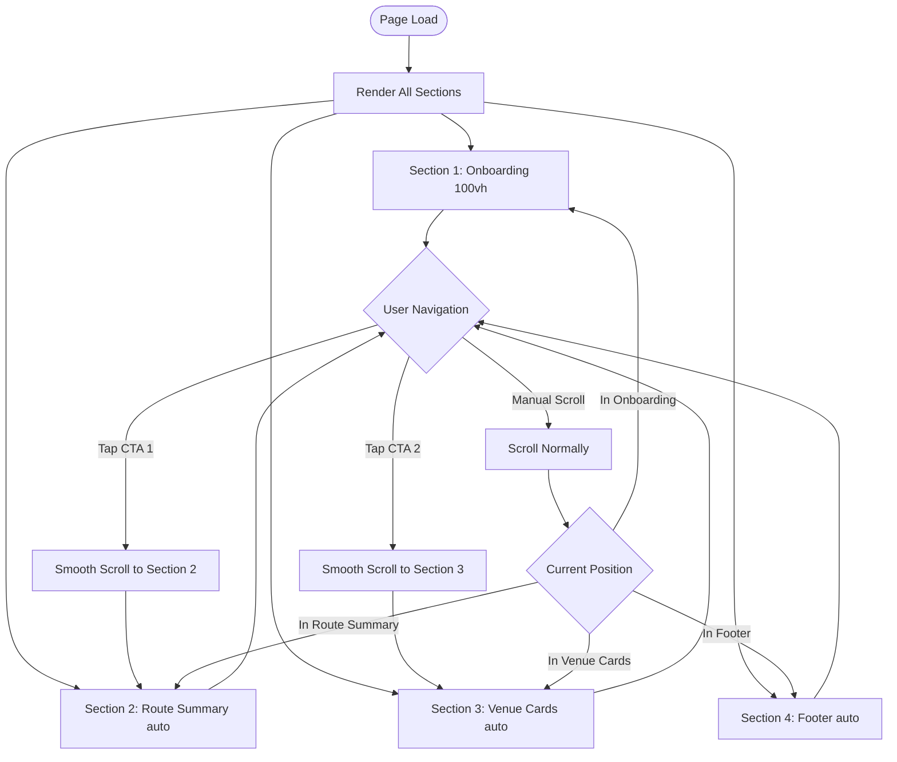

# UX Specification: Page Layout

**Platform**: Web (Mobile-first)

## User Flow



**Exit Path Behaviors:**
- **Page Close**: No state to persist, static content
- **Refresh**: Page reloads to initial state (Section 1), same daily routes displayed
- **Auto-scroll Interrupt**: If user scrolls during auto-scroll, user scroll takes over immediately

## Interaction Model

### Core Actions

- **manual_scroll**
  ```json
  {
    "trigger": "Touch drag or mouse wheel",
    "feedback": "Page scrolls in direction of input",
    "success": "User reaches desired section",
    "error": "N/A - scroll always works"
  }
  ```

- **auto_scroll_cta**
  ```json
  {
    "trigger": "Tap CTA button (Section 1 or 2)",
    "feedback": "Page begins smooth scrolling animation",
    "success": "Target section scrolls into view over 500ms with easing",
    "error": "N/A - target sections always exist"
  }
  ```

- **view_footer**
  ```json
  {
    "trigger": "User scrolls past Venue Cards section",
    "feedback": "Footer becomes visible",
    "success": "Attribution text readable",
    "error": "N/A - footer always present"
  }
  ```

### States & Transitions
```json
{
  "at_top": "Onboarding section in viewport, CTA 1 visible",
  "at_route_summary": "Route Summary in viewport, CTA 2 visible",
  "at_venue_cards": "Venue Cards in viewport, browsing venues",
  "at_footer": "Footer visible, user has explored full page"
}
```

## Quantified UX Elements

| Element | Formula / Source Reference |
|---------|----------------------------|
| Section 1 height | 100vh (fixed) |
| Section 2-4 height | auto (content-driven) |
| Auto-scroll duration | 500ms (from PRD.Navigation) |
| Section padding | 24px horizontal, 48px vertical |
| Page background | #0a0a0a |

## Platform-Specific Patterns

### Web
- **Responsive**: Section 1 maintains 100vh; other sections reflow; footer stays at bottom
- **Keyboard**: Tab navigates through interactive elements in document order; Space/PageDown scrolls
- **Browser**: Uses scroll-behavior: smooth CSS property; JS fallback for Safari < 15.4

### Mobile
- **Gestures**: Vertical swipe for scroll; no horizontal page swipe; momentum scrolling enabled
- **Offline**: Fully functional after initial load; static content cached

## Accessibility Standards

- **Screen Readers**: Semantic HTML5 sections with appropriate landmarks (main, footer); skip link to main content
- **Navigation**: Logical tab order through sections; focus visible on all interactive elements
- **Visual**: Background #0a0a0a provides consistent dark theme; all text meets WCAG AA contrast
- **Touch Targets**: All interactive elements minimum 44x44px; adequate spacing between targets

## Error Presentation

```json
{
  "network_failure": {
    "visual_indicator": "N/A - static pre-built content, no runtime network",
    "message_template": "N/A",
    "action_options": "N/A",
    "auto_recovery": "N/A"
  },
  "validation_error": {
    "visual_indicator": "N/A - no user input on page level",
    "message_template": "N/A",
    "action_options": "N/A",
    "auto_recovery": "N/A"
  },
  "timeout": {
    "visual_indicator": "N/A - no async operations",
    "message_template": "N/A",
    "action_options": "N/A",
    "auto_recovery": "N/A"
  },
  "permission_denied": {
    "visual_indicator": "N/A - no permissions required",
    "message_template": "N/A",
    "action_options": "N/A",
    "auto_recovery": "N/A"
  }
}
```
