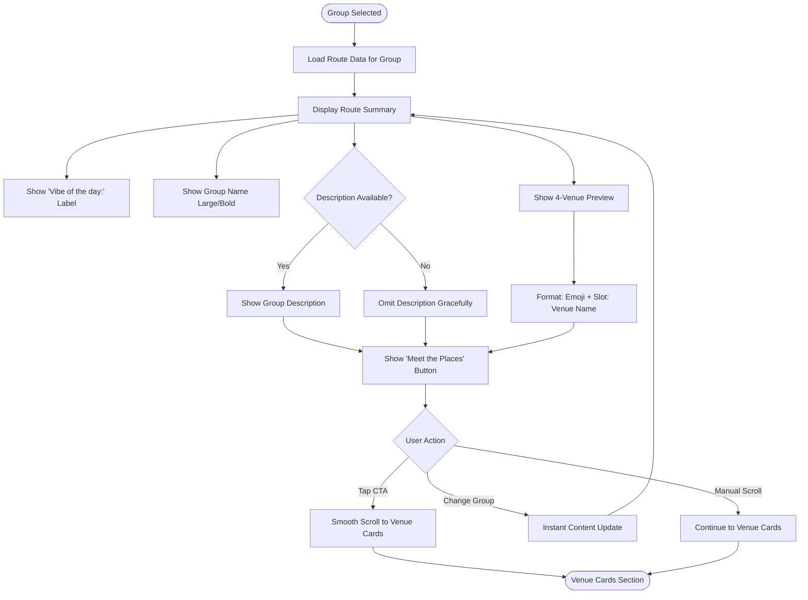

# UX Specification: Route Summary

**Platform**: Web (Mobile-first)

## User Flow



**Exit Path Behaviors:**
- **CTA Tap**: Triggers 500ms smooth scroll to venue cards, no cleanup needed
- **Manual Scroll**: Natural continuation, state persists
- **Group Change**: Content updates instantly via group-selector, no transition state

## Interaction Model

### Core Actions

- **tap_cta**
  ```json
  {
    "trigger": "Tap 'Meet the Places' button",
    "feedback": "Button shows pressed state",
    "success": "Page smoothly scrolls to Venue Cards section over 500ms",
    "error": "N/A - scroll target always exists"
  }
  ```

- **view_preview**
  ```json
  {
    "trigger": "Group selection changes",
    "feedback": "All content updates instantly (no animation)",
    "success": "Group name, description, 4 venues display for new selection",
    "error": "If description missing, only group name shown"
  }
  ```

### States & Transitions
```json
{
  "displaying": "Route summary visible with current group's data",
  "updating": "Content swapping to new group (instant, no visible state)",
  "scrolling": "Auto-scroll in progress to venue cards section"
}
```

## Quantified UX Elements

| Element | Formula / Source Reference |
|---------|----------------------------|
| Venue preview count | Fixed: 4 (one per slot) |
| Slot emoji mapping | SLOT_LABELS constant from data-model |
| Auto-scroll duration | 500ms (from PRD.Navigation) |
| Max venue name display | Truncate with ellipsis if > container width |

## Platform-Specific Patterns

### Web
- **Responsive**: Text sizes scale for readability; route preview stacks if needed on narrow viewports
- **Keyboard**: Tab to CTA button; Enter/Space activates scroll
- **Browser**: Uses scrollIntoView with behavior: 'smooth' or polyfill

### Mobile
- **Gestures**: Tap CTA to scroll; swipe on parent sections for manual navigation
- **Offline**: Static content, fully functional offline

## Accessibility Standards

- **Screen Readers**: aria-live="polite" on group name/description for updates; route preview as unordered list
- **Navigation**: Tab focuses CTA button; logical reading order (label, name, description, preview, button)
- **Visual**: Group name #ffffff on #0a0a0a = 21:1 contrast ratio; muted text #666666 = 5.5:1 ratio
- **Touch Targets**: CTA button minimum 48px height, full section width

## Error Presentation

```json
{
  "network_failure": {
    "visual_indicator": "N/A - static pre-generated content",
    "message_template": "N/A",
    "action_options": "N/A",
    "auto_recovery": "N/A"
  },
  "validation_error": {
    "visual_indicator": "N/A - no user input",
    "message_template": "N/A",
    "action_options": "N/A",
    "auto_recovery": "N/A"
  },
  "timeout": {
    "visual_indicator": "N/A - no async operations",
    "message_template": "N/A",
    "action_options": "N/A",
    "auto_recovery": "N/A"
  },
  "permission_denied": {
    "visual_indicator": "N/A - no permissions required",
    "message_template": "N/A",
    "action_options": "N/A",
    "auto_recovery": "N/A"
  }
}
```
