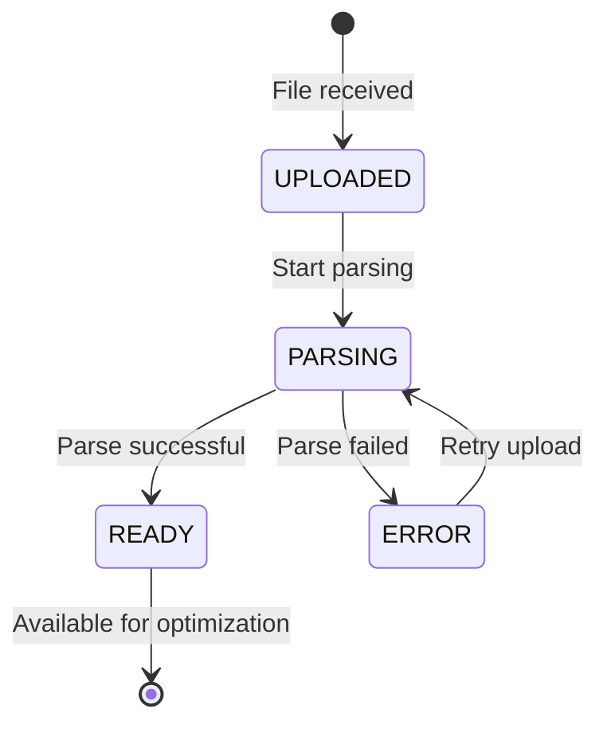

# Data Model - Upload CV Document

## Entities

### CVDocument
| Field | Type | Required | Validation |
|-------|------|----------|------------|
| id | UUID | Yes | Auto-generated |
| userId | String | Yes | Chrome extension session ID |
| fileName | String | Yes | Original filename |
| fileFormat | Enum | Yes | 'PDF' or 'DOCX' |
| fileSize | Integer | Yes | Bytes, max 10485760 (10MB) |
| blobUrl | String | Yes | Vercel Blob storage URL |
| rawContent | Text | Yes | Extracted text from document |
| metadata | JSON | No | { pageCount?, wordCount?, parsedAt } |
| uploadedAt | Timestamp | Yes | Auto-generated |
| status | Enum | Yes | 'UPLOADED', 'PARSING', 'READY', 'ERROR' |

### ParseError
| Field | Type | Required | Validation |
|-------|------|----------|------------|
| id | UUID | Yes | Auto-generated |
| cvDocumentId | UUID | Yes | Foreign key to CVDocument |
| errorType | Enum | Yes | 'INVALID_FORMAT', 'CORRUPTED', 'SIZE_EXCEEDED', 'PARSE_FAILED' |
| errorMessage | String | Yes | User-friendly error message |
| technicalDetails | Text | No | Stack trace or detailed error |
| occurredAt | Timestamp | Yes | Auto-generated |

## Relationships

CVDocument → ParseError: One-to-many (optional)
CVDocument → User: Many-to-one (via userId session identifier)

## State Diagram

## Storage Schema

**Database (PostgreSQL):**
- cv_documents table with fields above
- parse_errors table with fields above

**Blob Storage (Vercel Blob):**
- Path pattern: `cv-uploads/{userId}/{cvDocumentId}.{extension}`
- Retention: 30 days for free tier management
