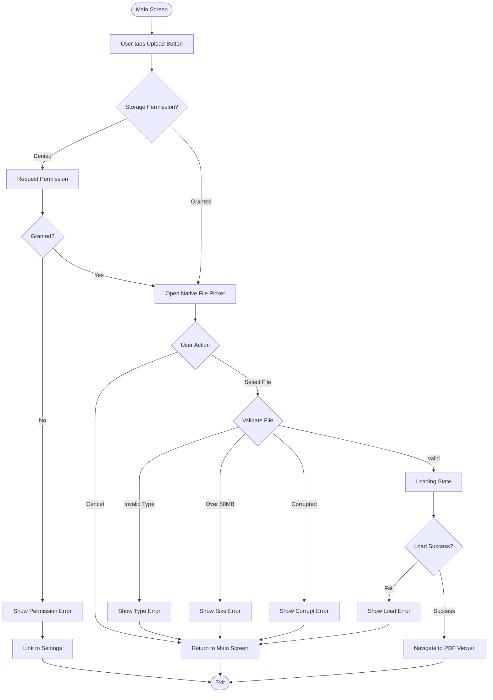

# UX Specification: Upload PDF Document

**Platform**: Mobile (iOS 12+, Android 5.0+)
**Dependencies**: `google-auth` or `apple-auth`, `create-signature`, `flutter-app-init`
**Spec Reference**: `./spec.md`

## User Flow



## Interaction Model

### Core Actions
```json
{
  "tap_upload_button": {
    "trigger": "User taps Upload Document button (56dp height minimum)",
    "pre_check": "Verify storage permission (Android only)",
    "feedback": "Button press animation + haptic feedback",
    "success": "Native file picker opens with PDF filter",
    "error": "Permission modal or permission settings prompt"
  },
  "select_file": {
    "trigger": "User selects PDF in file picker",
    "feedback": "Loading spinner + 'Loading document...' message",
    "validation": "Check file type (.pdf), size (<50MB), readability",
    "success": "Navigate to PDF viewer with loaded document",
    "error": "Modal with specific error + 'Try Again' button"
  },
  "cancel_picker": {
    "trigger": "User dismisses file picker without selecting",
    "feedback": "No visual feedback",
    "result": "Return to main screen silently"
  }
}
```

### States & Transitions
```json
{
  "main_screen_ready": "Upload button visible, enabled, prominent",
  "permission_requesting": "System permission dialog visible (Android)",
  "permission_denied": "Error message with settings link displayed",
  "picker_open": "Native file picker showing, PDF-only filter active",
  "loading_document": "Spinner + message 'Loading document...', picker dismissed",
  "validation_error": "Error modal with specific message, 'Try Again' action",
  "load_complete": "Transition to PDF viewer (smooth, no flash)"
}
```

## Platform-Specific Patterns

### Mobile - Touch Interactions
- **Primary Tap**: Large upload button (minimum 56dp height, centered)
- **Button Affordance**: Clear label "Upload Document to Sign" + document icon
- **Haptic Feedback**: Light tap on button press, medium tap on successful load
- **Native Pickers**:
  - iOS: `UIDocumentPickerViewController` with `com.adobe.pdf` filter
  - Android: `ACTION_GET_CONTENT` with `application/pdf` MIME type

### Mobile - Permission Flows
```json
{
  "android_storage_permission": {
    "first_request": "Show rationale: 'Access files to select PDF documents'",
    "system_prompt": "Native Android permission dialog",
    "denied_once": "Show inline message with 'Grant Permission' button",
    "denied_permanently": "Direct to app settings with explanation"
  },
  "ios_file_access": {
    "behavior": "No permission required - document picker handles access",
    "entitlement": "Ensure com.apple.developer.document-browser enabled"
  }
}
```

### Mobile - Loading Behavior
- **Short Load (<2s)**: Spinner only, no progress bar
- **Long Load (2-10s)**: Spinner + animated message + cancel option
- **Timeout (>10s)**: Show error "Loading timed out. Check file size or try smaller PDF"
- **Background**: Prevent screen sleep during load, lock orientation to portrait

### Mobile - Orientation
- **Main Screen**: Portrait-only (upload button optimized for vertical layout)
- **File Picker**: System default (typically portrait, user can rotate)
- **Transition**: Lock to portrait before navigating to PDF viewer

## UX Enhancements

### Performance
- **File Picker Open**: <200ms from button tap to picker display
- **File Validation**: <500ms (type check, size check, header validation)
- **PDF Load Time**: Target <3s for typical PDF (5-10 pages, 5MB)
- **Timeout Threshold**: 10s with clear timeout message and retry option

### Accessibility
- **Upload Button**:
  - VoiceOver/TalkBack label: "Upload document to sign. Button. Double-tap to open file picker."
  - Minimum touch target: 44pt (iOS) / 48dp (Android)
  - High contrast: Border visible in high-contrast mode
- **Loading State**: Announce "Loading document" to screen readers
- **Error Messages**: Auto-announced to screen readers with severity indication
- **Dynamic Text**: Button label scales with system font size (up to 200%)

### Error Prevention
- **File Type Filter**: PDF-only in native picker (prevent non-PDF selection)
- **Size Indicator**: If platform supports, show file size in picker preview
- **Confirmation Pattern**: No confirmation needed (fast-fail validation, easy retry)
- **Visual Cues**:
  - Upload button has document icon + text (never icon-only)
  - Disabled state: Grayed out if no signature exists yet

## Critical Scenarios

```json
{
  "user_cancels_picker": {
    "detection": "File picker dismissed without selection",
    "user_impact": "No action taken, returns to main screen",
    "solution": "Silent return, no error message (expected behavior)",
    "recovery": "User can tap upload button again immediately"
  },
  "file_too_large": {
    "detection": "File size >50MB in validation",
    "user_impact": "Cannot proceed with this file",
    "solution": "Modal: 'PDF too large. Please select a file under 50MB'",
    "recovery": "'Try Again' button reopens file picker"
  },
  "invalid_file_type": {
    "detection": "MIME type != application/pdf or extension != .pdf",
    "user_impact": "Cannot load non-PDF file",
    "solution": "Modal: 'Please select a valid PDF document'",
    "recovery": "'Try Again' button reopens file picker"
  },
  "corrupted_pdf": {
    "detection": "PDF parse error or missing pages",
    "user_impact": "File cannot be rendered",
    "solution": "Modal: 'This PDF appears corrupted. Please try another file.'",
    "recovery": "'Try Again' button reopens file picker"
  },
  "permission_denied_android": {
    "detection": "Storage permission denied by user",
    "user_impact": "Cannot open file picker",
    "solution": "Inline message: 'Storage access needed to select PDFs' + 'Grant Permission' button",
    "recovery": "Button opens app settings if denied permanently, re-requests if denied once"
  },
  "password_protected_pdf": {
    "detection": "PDF requires password to open",
    "user_impact": "Cannot load document (MVP limitation)",
    "solution": "Modal: 'Password-protected PDFs are not supported. Please select an unprotected file.'",
    "recovery": "'Try Again' button reopens file picker"
  }
}
```

## Success Metrics
- **Task Completion Rate**: >90% (users who tap upload successfully load a PDF)
- **Time to PDF Viewer**: <5s from button tap to viewer displayed (typical file)
- **Error Rate**: <10% (validation or load failures)
- **Permission Grant Rate**: >85% on Android (first-time permission requests)
- **Cancellation Rate**: <20% (users who cancel picker after opening)
