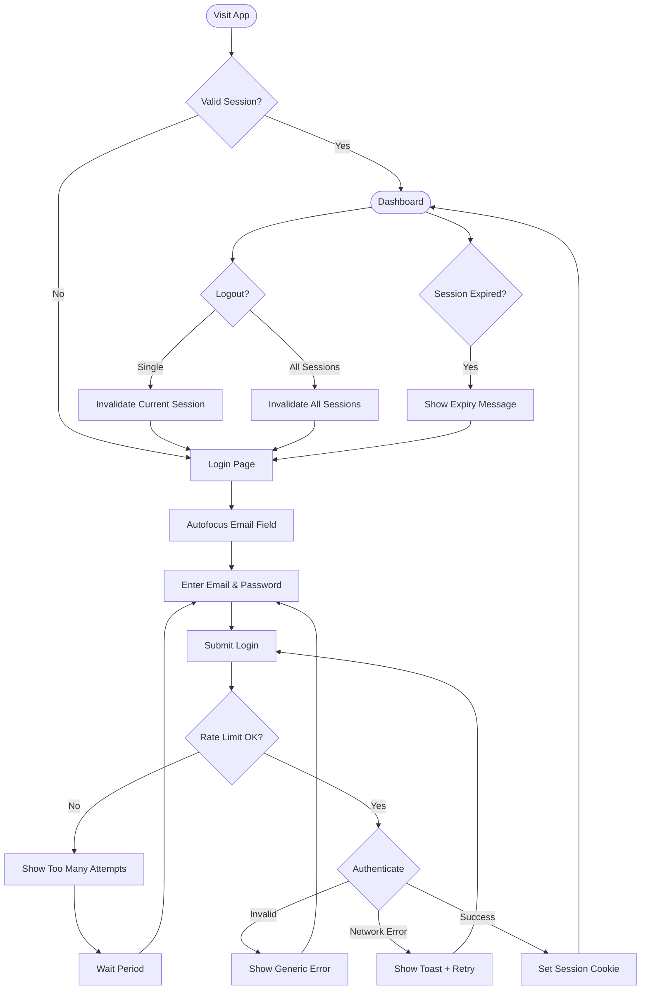

# UX Specification: User Authentication

**Platform**: Web (Mobile-first Responsive)

## User Flow



**Exit Path Behaviors:**
- **Navigate to Sign-up**: No cleanup needed, form state cleared
- **Close Browser**: Session persists in cookie (until expiry)
- **Logout**: Session cookie invalidated, redirect to login
- **Back Button (from dashboard)**: No action, stay on dashboard

## Interaction Model

### Core Actions
- **submit_login**
  ```json
  {
    "trigger": "Tap/click login button or press Enter",
    "feedback": "Button shows loading spinner, form disabled",
    "success": "Redirect to dashboard",
    "error": "Generic error message inline (not revealing which field failed)"
  }
  ```

- **logout**
  ```json
  {
    "trigger": "Tap logout button in Account tab",
    "feedback": "Immediate visual confirmation",
    "success": "Redirect to login page, session cleared",
    "error": "Toast if network fails, retry option"
  }
  ```

- **logout_all_sessions**
  ```json
  {
    "trigger": "Tap 'Logout all devices' in Account settings",
    "feedback": "Confirmation dialog, then loading state",
    "success": "All sessions invalidated, redirect to login",
    "error": "Toast with retry option"
  }
  ```

### States & Transitions
```json
{
  "unauthenticated": "No valid session, show login page",
  "authenticating": "Login request in progress",
  "authenticated": "Valid session, access to protected routes",
  "session_expired": "Session invalidated, redirect to login with message",
  "rate_limited": "Too many attempts, show wait message"
}
```

## Quantified UX Elements

| Element | Formula / Source Reference |
|---------|----------------------------|
| Rate limit threshold | 10 requests/minute/IP (constant) |
| Session TTL | Configurable server-side (default defined in data-model.md) |
| Rate limit wait period | 60 seconds (constant) |

## Platform-Specific Patterns

### Web
- **Responsive**: Single-column form on mobile (<768px), centered card on desktop
- **Keyboard**: Tab navigation between fields, Enter submits form
- **Browser**: HTTP-only cookie prevents XSS access, no localStorage for tokens

## Accessibility Standards

- **Screen Readers**: ARIA `role="form"`, `aria-live="polite"` for error announcements, `aria-describedby` for field errors
- **Navigation**: Tab cycles through Email → Password → Login → Sign-up link, Enter submits
- **Visual**: Contrast ratio 4.5:1 minimum, error states use icon + text (not color alone)
- **Touch Targets**: 44px minimum height for all buttons and inputs

## Error Presentation

```json
{
  "network_failure": {
    "visual_indicator": "Toast notification at top of screen",
    "message_template": "Connection failed. Please check your internet and try again.",
    "action_options": "Retry button in toast",
    "auto_recovery": "Toast auto-dismisses after 5s, form data preserved"
  },
  "validation_error": {
    "visual_indicator": "Inline message below form (not per-field)",
    "message_template": "Invalid email or password. Please try again.",
    "action_options": "User re-enters credentials",
    "auto_recovery": "Error clears on next submission attempt"
  },
  "timeout": {
    "visual_indicator": "Toast notification",
    "message_template": "Request timed out. Please try again.",
    "action_options": "Retry button in toast",
    "auto_recovery": "Form re-enabled, data preserved"
  },
  "permission_denied": {
    "visual_indicator": "Inline message with countdown",
    "message_template": "Too many login attempts. Please wait {seconds} seconds.",
    "action_options": "None until countdown completes",
    "auto_recovery": "Form re-enables when rate limit resets"
  }
}
```
