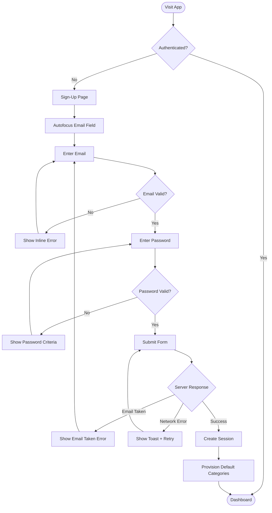

# UX Specification: User Registration

**Platform**: Web (Mobile-first Responsive)

## User Flow



**Exit Path Behaviors:**
- **Navigate to Login**: No cleanup needed, form state cleared
- **Close Browser**: No cleanup needed, no data persisted
- **Back Button**: Form state cleared, return to landing/login page

## Interaction Model

### Core Actions
- **submit_registration**
  ```json
  {
    "trigger": "Tap/click submit button or press Enter",
    "feedback": "Button shows loading spinner, form fields disabled",
    "success": "Redirect to dashboard, session cookie set",
    "error": "Inline error for validation, toast for network issues"
  }
  ```

- **validate_email**
  ```json
  {
    "trigger": "Blur from email field or form submission",
    "feedback": "Instant inline validation message",
    "success": "Green checkmark or no message",
    "error": "Red inline message below field"
  }
  ```

- **validate_password**
  ```json
  {
    "trigger": "Blur from password field or form submission",
    "feedback": "Instant inline validation with criteria list",
    "success": "Criteria items marked as satisfied",
    "error": "Unmet criteria highlighted in red"
  }
  ```

### States & Transitions
```json
{
  "idle": "Form ready for input, email field focused",
  "validating": "Client-side validation in progress",
  "submitting": "Request sent, awaiting server response",
  "error": "Validation or server error displayed",
  "success": "Registration complete, redirecting"
}
```

## Quantified UX Elements

| Element | Formula / Source Reference |
|---------|----------------------------|
| Password minimum length | 8 characters (constant) |
| Rate limit threshold | 10 requests/minute/IP (constant) |
| Form field height | 44px minimum (accessibility constant) |

## Platform-Specific Patterns

### Web
- **Responsive**: Single-column form on mobile (<768px), centered card on desktop
- **Keyboard**: Tab navigation between fields, Enter submits form
- **Browser**: Form autofill supported for email field

## Accessibility Standards

- **Screen Readers**: ARIA `role="form"`, `aria-invalid` on error fields, `aria-describedby` linking errors to fields
- **Navigation**: Tab cycles through Email → Password → Submit, Enter submits, Escape clears focus
- **Visual**: Contrast ratio 4.5:1 minimum for text, error states use icon + color (not color alone)
- **Touch Targets**: 44px minimum height for all interactive elements

## Error Presentation

```json
{
  "network_failure": {
    "visual_indicator": "Toast notification at top of screen",
    "message_template": "Connection failed. Please check your internet and try again.",
    "action_options": "Retry button in toast",
    "auto_recovery": "Toast auto-dismisses after 5s, form data preserved"
  },
  "validation_error": {
    "visual_indicator": "Red border on field, inline message below",
    "message_template": "Please enter a valid email address / Password must be at least 8 characters",
    "action_options": "User corrects input",
    "auto_recovery": "Error clears when field becomes valid on blur"
  },
  "timeout": {
    "visual_indicator": "Toast notification",
    "message_template": "Request timed out. Please try again.",
    "action_options": "Retry button in toast",
    "auto_recovery": "Form re-enabled, data preserved"
  },
  "permission_denied": {
    "visual_indicator": "Inline error below email field",
    "message_template": "This email is already registered. Try logging in instead.",
    "action_options": "Link to login page",
    "auto_recovery": "None, user must change email or navigate to login"
  }
}
```
