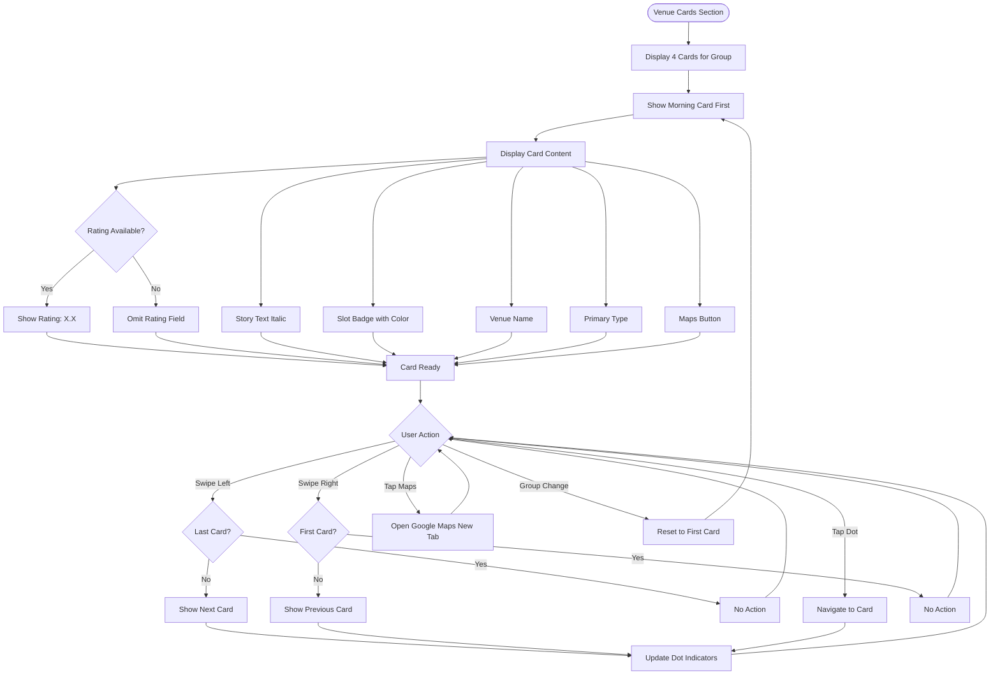

# UX Specification: Venue Cards

**Platform**: Web (Mobile-first)

## User Flow



**Exit Path Behaviors:**
- **Scroll Away**: Current card position retained until group change
- **Group Change**: Carousel resets to first card (Morning), all cards update to new group data
- **Open Maps**: New tab opens, user remains on page with current state

## Interaction Model

### Core Actions

- **swipe_card**
  ```json
  {
    "trigger": "Horizontal swipe gesture on card carousel",
    "feedback": "Card animates in swipe direction, dot indicator updates",
    "success": "Adjacent card becomes visible, dots reflect new position",
    "error": "At boundary (first or last card), swipe bounces back"
  }
  ```

- **tap_dot**
  ```json
  {
    "trigger": "Tap on dot indicator",
    "feedback": "Tapped dot highlights, carousel animates to target card",
    "success": "Target card visible, all dots update",
    "error": "N/A - all dots valid targets"
  }
  ```

- **tap_maps**
  ```json
  {
    "trigger": "Tap 'Open in Google Maps' button",
    "feedback": "Button shows pressed state briefly",
    "success": "Google Maps opens in new browser tab with venue location",
    "error": "Browser handles malformed URI; user sees Google Maps error page"
  }
  ```

### States & Transitions
```json
{
  "morning_visible": "Morning slot card displayed, dot 1 active",
  "lunch_visible": "Lunch slot card displayed, dot 2 active",
  "afternoon_visible": "Afternoon slot card displayed, dot 3 active",
  "evening_visible": "Evening slot card displayed, dot 4 active"
}
```

## Quantified UX Elements

| Element | Formula / Source Reference |
|---------|----------------------------|
| Card count | Fixed: 4 (one per slot) |
| Rating format | "Rating: X.X" where X.X from venue.rating |
| Story length | 2-3 sentences (from PRD.Technical Constraints) |
| Slot colors | Morning: #ffb347, Lunch: #ff6b6b, Afternoon: #4ecdc4, Evening: #a855f7 |

## Platform-Specific Patterns

### Web
- **Responsive**: Cards scale width to viewport; story text reflows; minimum card height prevents content cutoff
- **Keyboard**: Tab to card content; Arrow keys navigate cards when focused; Enter on Maps button opens link
- **Browser**: Maps link uses target="_blank" with rel="noopener noreferrer" for security

### Mobile
- **Gestures**: Horizontal swipe with 50px threshold; tap for Maps; no pinch/zoom on cards
- **Offline**: Card content static, fully offline; Maps button requires connectivity for Google Maps

## Accessibility Standards

- **Screen Readers**: role="region" with aria-label per card; slot badge as aria-label prefix; Maps button aria-label includes venue name
- **Navigation**: Tab through card content; Arrow keys on carousel container; Enter on interactive elements
- **Visual**: Slot badge colors pass 4.5:1 on dark backgrounds; rating and type text at 5.5:1 minimum
- **Touch Targets**: Maps button 48px height, full card width; dot indicators 44x44px

## Error Presentation

```json
{
  "network_failure": {
    "visual_indicator": "N/A - static content; Maps requires network but handled by browser",
    "message_template": "N/A",
    "action_options": "N/A",
    "auto_recovery": "N/A"
  },
  "validation_error": {
    "visual_indicator": "Missing rating field omitted from display",
    "message_template": "N/A - graceful degradation, no message needed",
    "action_options": "N/A",
    "auto_recovery": "Card displays without rating field"
  },
  "timeout": {
    "visual_indicator": "N/A - no async operations",
    "message_template": "N/A",
    "action_options": "N/A",
    "auto_recovery": "N/A"
  },
  "permission_denied": {
    "visual_indicator": "N/A - Maps opens in browser, no app permissions",
    "message_template": "N/A",
    "action_options": "N/A",
    "auto_recovery": "N/A"
  }
}
```
